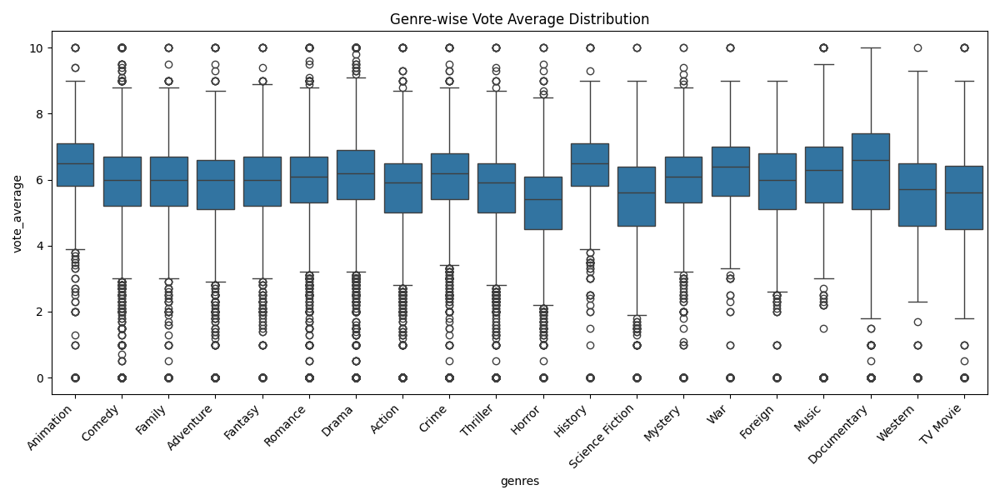
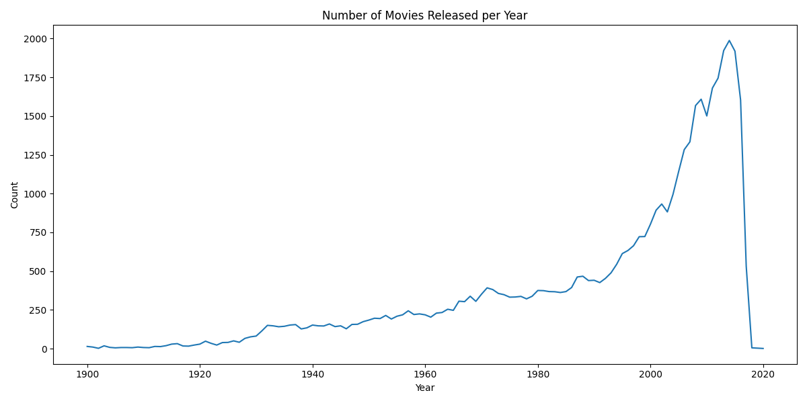
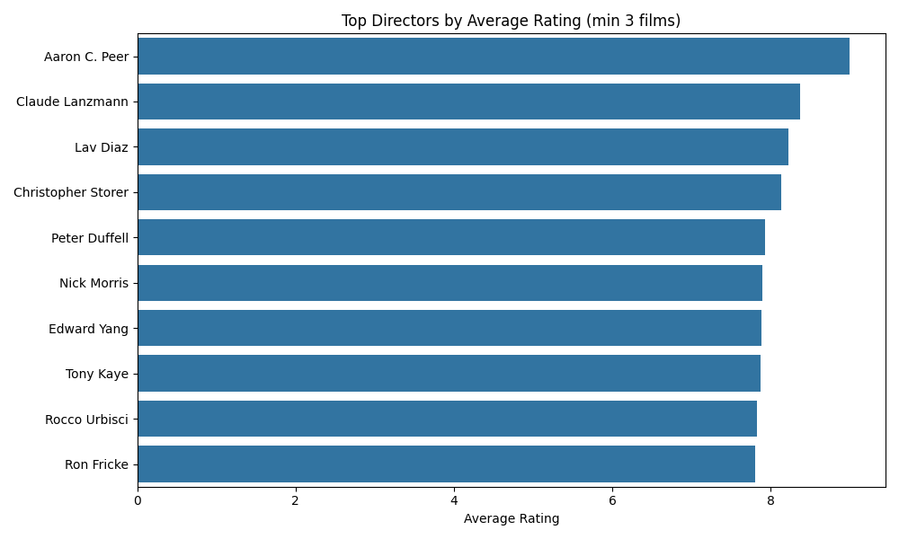
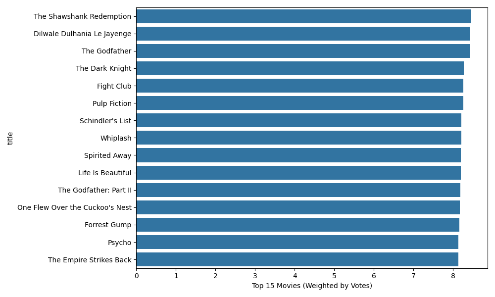

# Movie Insights: 통합 영화 데이터 분석 프로젝트

## 프로젝트 개요

이 프로젝트는 Kaggle에서 제공하는 영화 데이터셋을 기반으로, 따양한 영화 메타데이터와 평점 정보를 분석하여 다음과 같은 인사이트를 도출할 수 있다.

- 인기 영화 탐색
- 장르별 특성 비교
- 연도별 트렌드 분석
- 감독 및 배우 중심 분석
- 키워드 기반 영화 분류
- 유저 평점 기반 인기 영화 선정

## 디렉토리 구조

```
da_movie_mini/
├── Readme.md
├── requirements.txt
├── data/
│   ├── raw/            # 원본 CSV 데이터
│   └── processed/      # 전처리된 통합 데이터
├── src/                # 기능별 분석 및 시각화 모듈
│   ├── preprocessing.py
│   ├── analysis_genre.py
│   ├── analysis_time.py
│   ├── analysis_cast.py
│   ├── analysis_keywords.py
│   └── analysis_rating.py
├── scripts/            # 분석 실행 스크립트
│   ├── run_preprocessing.py
│   ├── run_genre_analysis.py
│   ├── run_time_analysis.py
│   ├── run_cast_analysis.py
│   ├── run_keywords_analysis.py
└── output/
    ├── figures/        # 시각화 결과 이미지
    └── tables/         # 분석 결과 테이블
```

## 분석 주제 및 결과

### 1. 장르별 분석
- 평균 평점 / 평점 분포 (Boxplot)
- 

### 2. 연도별 분석
- 제작 수, 평균 평점, 인기 점수 변화
- 

### 3. 감독 및 배우 분석
- 감독별 평균 평점 상위
- 출연 횟수 많은 배우 Top 20
- 

### 4. 키워드 분석
- 가장 많이 사용된 키워드 시각화
- 워드클라우드 생성
- 

### 5. 유저 평점 기반 인기 영화 선정
- IMDB 방식 가중 평점 (Weighted Rating)
- 

---

## 실행 방법

```bash
# 1. 의존성 설치
pip install -r requirements.txt

# 2. 전처리 실행
python scripts/run_preprocessing.py

# 3. 분석 실행
python scripts/run_genre_analysis.py
python scripts/run_time_analysis.py
python scripts/run_cast_analysis.py
python scripts/run_keywords_analysis.py
python scripts/run_rating_analysis.py
```

---

## 사용 라이브러리
- pandas, matplotlib, seaborn, numpy, wordcloud
- ast, json, datetime
- optional: scikit-surprise (for recommendation)

---

## 사용 데이터 출처
- [The Movies Dataset on Kaggle](https://www.kaggle.com/datasets/rounakbanik/the-movies-dataset)

---

## 작성자
- Github: [CelestynPark]
- Contact: sbeep2001@gmail.com